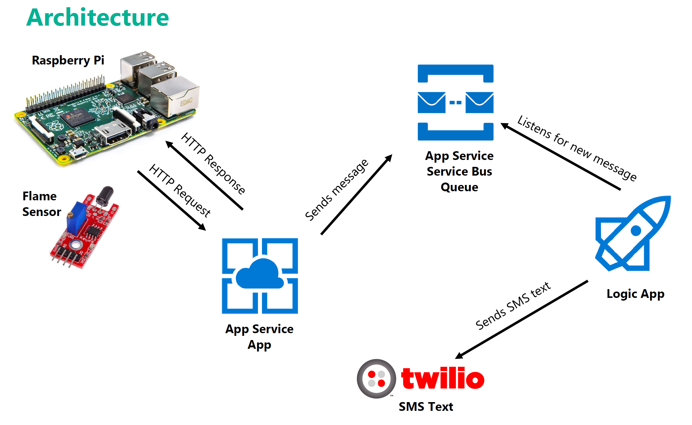

# FlameSensor
Sends notification if flame is sensed via HTTP REST Request to custom API App which inserts a message into a Service Bus Queue that triggers a Logic App to send an SMS notification.

## Technologies
- Raspberry Pi 2 Model B v1.1
- Windows 10 IoT Core
- Windows UWP App on Pi
- Windows UWP IoT Extension
- .NET Core App on App Service
- Flame Sensor (ex. Keyes KY-026)
- Azure App Service
- API Management (REST API)
- Event Hub
- Logic App
- Office 365

# Setup

## Azure Setup

1. [Create Service Bus Queue](https://docs.microsoft.com/en-us/azure/service-bus-messaging/service-bus-dotnet-get-started-with-queues) 
2. Create a Logic App to trigger on new message in the queue and send to email, SMS with twilio, or to do whatever you'd like!

## Steps to Run the App Service API App
1. Download all of the files in the repository
2. Open the solution in Visual Studio
3. Update the FlameSensor.AppService\Web.config file with your API App Enpoint connection string and save it (ex. `Endpoint=sb://kristinottofyflamesensor.servicebus.windows.net/;SharedAccessKeyName=RootManageSharedAccessKey;SharedAccessKey=07/OdwTJuMV+Lu9Ig5af47lLnGRGIWX6xFjmOKFDE1I=`)
4. Build the App Service project
5. Publish the App Service project to an Azure Web API App

## Steps to run the Raspberry Pi App
1. Change the run mode in Visual Studio to Remote Machine
2. Update the IP Address of the Remote Connection
    * (Option A). If the Remote Connection window appeared after step 4, update the IP address with your IoT device IP address 
    * (Option B) Otherwise, double click on Properties in the Solution Explorer and update the Debug section with your IoT device's IP address
3. Nuget packages may need to be restored and project may need to be built or rebuilt and few times.
4. Run the project on the Remote Machine

## Many thanks to Brady Gaster!
- Project built on top of [LeapDayTinkering](https://github.com/bradygaster/LeapDayTinkering"LeapDayTinkering")
- Reference: [Build an Azure App Service to record Raspberry Pi Sensor Data](https://azure.microsoft.com/en-us/blog/build-an-azure-app-service-to-record-raspberry-pi-sensor-data/)

